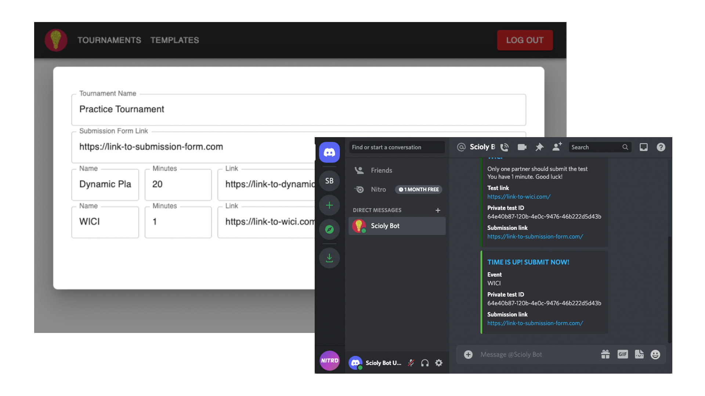

<!--
*** Thanks for checking out the Best-README-Template. If you have a suggestion
*** that would make this better, please fork the repo and create a pull request
*** or simply open an issue with the tag "enhancement".
*** Don't forget to give the project a star!
*** Thanks again! Now go create something AMAZING! :D
-->

<!-- PROJECT LOGO -->
 

  

<h3 align="center">Scioly Bot</h3>

  

    Automate Science Olympiad tournaments through Discord
     
    <a href="#demo">View Demo</a>
    ·
    <a href="https://scioly-bot.herokuapp.com/">Live Site</a>
  

<!-- TABLE OF CONTENTS -->

  
Table of Contents

  <ol>
    <li>
      <a href="#about-the-project">About The Project</a>
    </li>
    <li><a href="#demo">Demo</a></li>
    <li><a href="#routes">Routes</a></li>
    <li><a href="#database">Database</a></li>
    <li><a href="#acknowledgments">Acknowledgments</a></li>
  </ol>

<!-- ABOUT THE PROJECT -->

## About The Project

### Built With

- [Express](https://expressjs.com/)
- [React.js](https://reactjs.org/)
- [Discord.js](https://discord.js.org/)
- [PostgreSQL](https://www.postgresql.org/)

(<a href="#top">back to top</a>)

## Demo

(<a href="#top">back to top</a>)

### Project Structure

Monorepo using npm workspaces.

- [packages](./packages)
  - [server](./packages/server/)
    - Express server
  - [client](./packages/client/)
    - React app
  - [bot](./packages/bot/)
    - Discord.js bot
  - [models](./packages/models/)
    - Sequelize database models
    - referenced by backend and bot
  - [types](./packages/types/)
    - TypeScript types and Yup validation schemas
    - referenced by backend, frontend, models, bot, and fixtures
  - [config](./packages/config/)
    - loads environment variables
    - referenced by backend and bot
  - [fixtures](./packages/fixtures/)
    - test data
    - referenced by backend and frontend
- [cypress](./cypress/)
  - End-to-end tests
  - Work-in-progress

(<a href="#top">back to top</a>)

## Routes

### Client

- /
  - basic usage instructions and examples
- /templates
  - client page for managing templates
- /tournaments
  - client page for managing tournaments

### OAuth Authentication

- /auth/discord
  - redirects to Discord OAuth page
- /auth/discord/callback
  - redirected to here after authenticating in Discord
- /auth/discord/user
  - retrieves user if signed in
- /auth/discord/logout
  - POST logs user out

### REST API

- /api/templates
  - supports GET and POST
- /api/templates/:id
  - supports GET, PUT, PATCH, and DELETE
- /api/tournaments
  - supports GET and POST
- /api/tournaments/:id
  - supports GET, PUT, PATCH, and DELETE

(<a href="#top">back to top</a>)

## Database

- `users` refer to administrators who sign into the web application
- the `user ids` in `tests` are the Discord ids of users running commands through the bot

(<a href="#top">back to top</a>)

## Acknowledgments

- [README Template](https://github.com/othneildrew/Best-README-Template)

(<a href="#top">back to top</a>)

