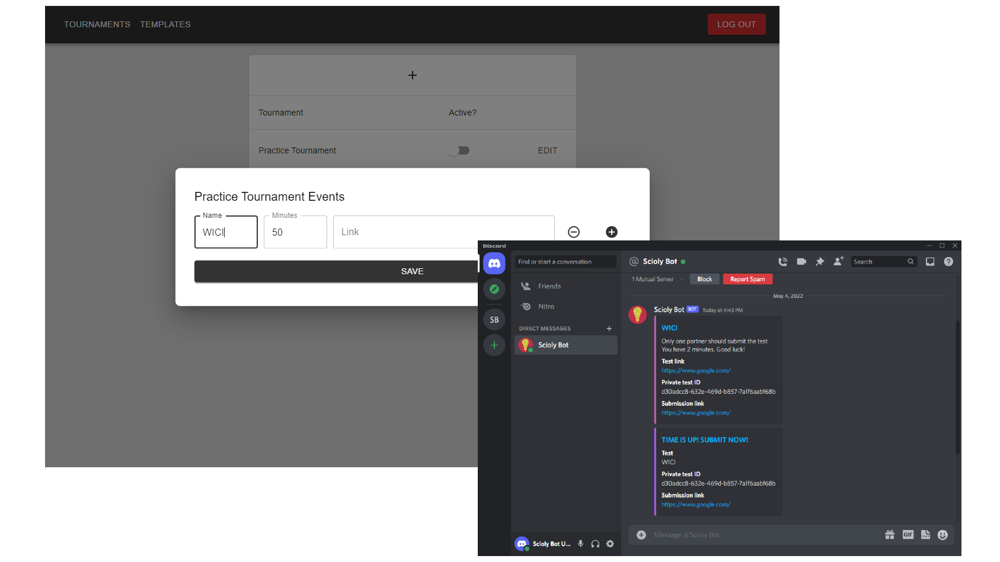

<div id="top"></div>
<!--
*** Thanks for checking out the Best-README-Template. If you have a suggestion
*** that would make this better, please fork the repo and create a pull request
*** or simply open an issue with the tag "enhancement".
*** Don't forget to give the project a star!
*** Thanks again! Now go create something AMAZING! :D
-->

<!-- PROJECT LOGO -->
<br />
<div align="center">
  <a href="https://github.com/dpang314/Scioly-Bot">
    
  </a>

<h3 align="center">Scioly Bot</h3>

  <p align="center">
    Automate Science Olympiad tournaments through Discord!
    <br />
    <!--<a href="https://github.com/dpang314/Scioly-Bot">View Demo</a>
    ·-->
    <a href="https://github.com/dpang314/Scioly-Bot/issues">Report Bug</a>
    ·
    <a href="https://github.com/dpang314/Scioly-Bot/issues">Request Feature</a>
  </p>
</div>

<!-- TABLE OF CONTENTS -->
<details>
  <summary>Table of Contents</summary>
  <ol>
    <li>
      <a href="#about-the-project">About The Project</a>
      <ul>
        <li><a href="#built-with">Built With</a></li>
      </ul>
    </li>
    <li>
      <a href="#getting-started">Getting Started</a>
      <ul>
        <li><a href="#installation">Installation</a></li>
      </ul>
    </li>
    <!--<li><a href="#usage">Usage</a></li> -->
    <li><a href="#roadmap">Roadmap</a></li>
    <li><a href="#contributing">Contributing</a></li>
    <li><a href="#license">License</a></li>
    <li><a href="#contact">Contact</a></li>
    <li><a href="#acknowledgments">Acknowledgments</a></li>
  </ol>
</details>


<!-- ABOUT THE PROJECT -->
## About The Project


<p align="right">(<a href="#top">back to top</a>)</p>


### Built With

* [Next.js](https://nextjs.org/)
* [React.js](https://reactjs.org/)
* [Discord.js](https://discord.js.org/)
* [PostgreSQL](https://www.postgresql.org/)

<p align="right">(<a href="#top">back to top</a>)</p>

<!-- GETTING STARTED -->
## Getting Started

To get a local copy up and running follow these steps.

### Installation

1. Clone the repo

   ```sh
   git clone https://github.com/dpang314/Scioly-Bot
   cd Scioly-Bot
   ```

2. Install NPM packages

   ```sh
   npm install
   ```

3. Rename example.env to .env

   ```sh
   mv example.env .env
   ```

4. Sign in to the Discord Developer Portal [https://discord.com/login?redirect_to=%2Fdevelopers%2Fapplications](https://discord.com/login?redirect_to=%2Fdevelopers%2Fapplications)
5. Create a new application and add a bot in the Bot tab
6. Go to the URL Generator under the OAuth2 tab. Select the applications.commands and bot scopes. From the Bot Permissions, select Send Messages and Embed Links. Open that link in a new tab and add the bot to your server.
7. Reset the token then copy paste the token into .env

    ```text
    DISCORD_TOKEN=your_token
    ```

8. Go to the OAuth2 tab and copy paste the Client ID and Client Secret into .env

    ```text
    CLIENT_ID=your_client_id
    DISCORD_SECRET=your_secret
    ```

9. Open Discord and copy the id of your server from step 5 into .env

    ```text
    GUILD_ID=your_server_id
    ```

10. Paste your PostgreSQL database connection string into .env

    ```text
    DATABASE_CONNECTION=your_connection_string
    ```

11. Generate a string used by NextAuth and paste it into .env

    ```sh
    openssl rand -base64 32
    ```

    ```text
    NEXT_SECRET=your_generated_string
    ```

12. Run the script to register the bot slash commands

    ```sh
    npm run bot:commands
    ```

13. Start the bot

    ```sh
    npm run bot:dev
    ```

14. Start the website

    ```sh
    npm run next:dev
    ```

<p align="right">(<a href="#top">back to top</a>)</p>


<!-- USAGE EXAMPLES -->
## Usage

<p align="right">(<a href="#top">back to top</a>)</p>

<!-- ROADMAP -->
## Roadmap

* [ ] Refactor frontend to React
* [ ] Refactor backend to Express.js
* [ ] Allow administrators from any server to create and manage tournaments for their servers
* [ ] Improve submission tracking

See the [open issues](https://github.com/dpang314/Scioly-Bot/issues) for a full list of proposed features (and known issues).

<p align="right">(<a href="#top">back to top</a>)</p>

<!-- CONTRIBUTING -->
## Contributing

Contributions are appreciated!

If you have a suggestion that would make this better, please fork the repo and create a pull request. You can also simply open an issue with the tag "enhancement".

1. Fork the Project
2. Create your Feature Branch (`git checkout -b feature/AmazingFeature`)
3. Commit your Changes (`git commit -m 'Add some AmazingFeature'`)
4. Push to the Branch (`git push origin feature/AmazingFeature`)
5. Open a Pull Request

<p align="right">(<a href="#top">back to top</a>)</p>

<!-- CONTACT -->
## Contact

Project Link: [https://github.com/dpang314/Scioly-Bot](https://github.com/dpang314/Scioly-Bot)

<p align="right">(<a href="#top">back to top</a>)</p>


<!-- ACKNOWLEDGMENTS -->
## Acknowledgments

* [README Template](https://github.com/othneildrew/Best-README-Template)

<p align="right">(<a href="#top">back to top</a>)</p>
